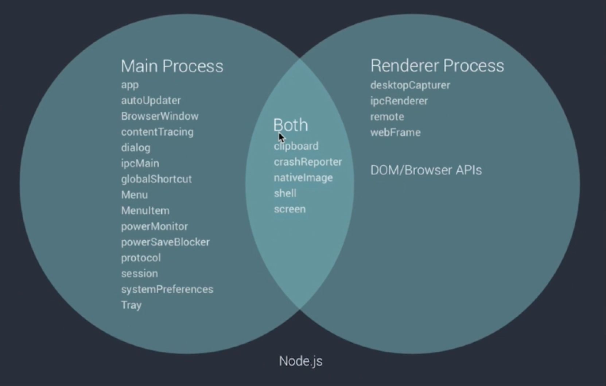

### 如何使用nodejs模块：

在preload 中加载
[Read more about Context Isolation](https://github.com/electron/electron/blob/master/docs/tutorial/context-isolation.md).

### 主进程，渲染进程
主进程：
- 使用和系统对接的Electron API - 创建菜单，上传文件等
- 创建渲染进程，统领渲染进程
- 全面支持nodejs
- 只有一个，作为程序的入口

渲染进程：
- 可以有多个，每个对应一个窗口
- 每个都是一个单独的进程
- 全面支持nodejs
- 可以使用一部分Electron提供的API

wait on d等待ready